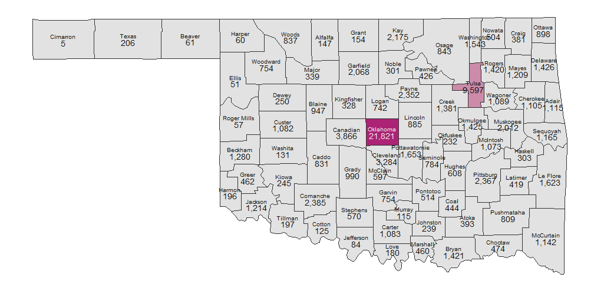
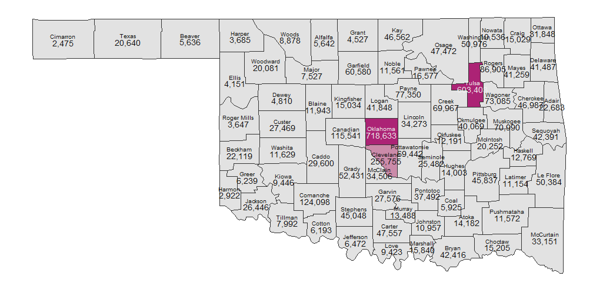

## County Counts For 2002-2012

<!-- Point knitr to the underlying code file so it knows where to look for the chunks. -->


```r
# pathInputDirectory <-
# 'F:/Projects/OuHsc/SafeCare/Spatial/SafeCareSpatial/PhiFreeDatasets'
pathInputDirectory <- file.path(getwd(), "PhiFreeDatasets")
pathInputSummaryCounty <- file.path(pathInputDirectory, "CountCountyFortified.csv")

dsValueAllVariables <- read.csv(pathInputSummaryCounty, stringsAsFactors = FALSE)
```


```r
dvName <- "CountPerCapitaAnnual"  #The number of victims per county population; darker counties have more victims, adjusted for pop
dsValueAllVariables$DV <- dsValueAllVariables[, dvName]
# dsValueAllVariables$DVLabel <- round(dsValueAllVariables$DV, 2) #Keeps
# leading zeros
dsValueAllVariables$DVLabel <- gsub("^0.", ".", round(dsValueAllVariables$DV, 
    3))  #Remove leading zeros.
MapCounties(dsValueAllVariables, deviceWidth = 14)
```

 


```r
dvName <- "CountPerCapitaRank"  #The county's rank for the number of victims per county population; darker counties have more victims, adjusted for pop
dsValueAllVariables$DV <- dsValueAllVariables[, dvName]
dsValueAllVariables$DVLabel <- dsValueAllVariables$DV
MapCounties(dsValueAllVariables, deviceWidth = 14)
```

 


```r
dvName <- "Count"  #The county's rank for the number of victims per county population; darker counties have more total victims
dsValueAllVariables$DV <- dsValueAllVariables[, dvName]
dsValueAllVariables$DVLabel <- scales::comma(dsValueAllVariables$DV)
MapCounties(dsValueAllVariables, deviceWidth = 14)
```

 


```r
dvName <- "PopTotal"  #The county's 2010 census population; darker counties have more people
dsValueAllVariables$DV <- dsValueAllVariables[, dvName]
dsValueAllVariables$DVLabel <- scales::comma(dsValueAllVariables$DV)
MapCounties(dsValueAllVariables, deviceWidth = 14)
```

 

