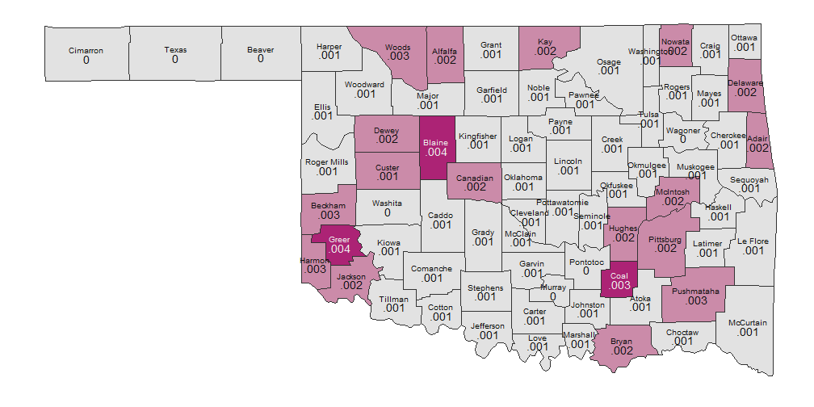
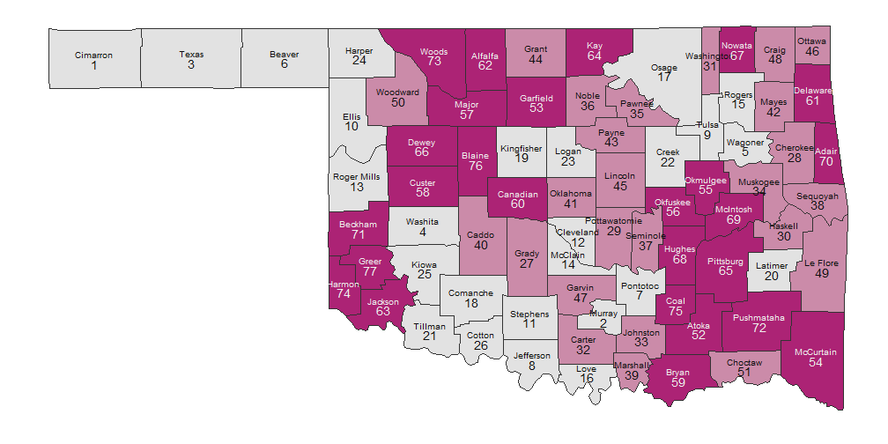

## County Counts For 2002-2012

<!-- Point knitr to the underlying code file so it knows where to look for the chunks. -->


```r
# pathInputDirectory <-
# 'F:/Projects/OuHsc/SafeCare/Spatial/SafeCareSpatial/PhiFreeDatasets'
pathInputDirectory <- file.path(getwd(), "PhiFreeDatasets")
pathInputSummaryCounty <- file.path(pathInputDirectory, "CountCountyFortified.csv")

dsValueAllVariables <- read.csv(pathInputSummaryCounty)
```


```r
dvName <- "CountPerCapita"  #The number of victims per county population; darker counties are more safe
dsValue <- data.frame(CountyName = tolower(dsValueAllVariables$CountyName), 
    DV = dsValueAllVariables[, dvName])
MapCounties(dsValue)
```

 


```r
dvName <- "CountPerCapitaRank"  #The county's rank for the number of victims per county population; darker counties are more safe
dsValue <- data.frame(CountyName = tolower(dsValueAllVariables$CountyName), 
    DV = dsValueAllVariables[, dvName])
MapCounties(dsValue)
```

 


